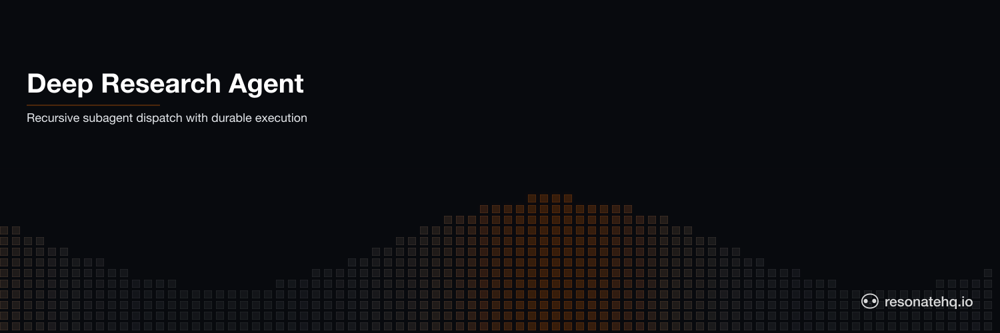

<picture>
  <source media="(prefers-color-scheme: dark)" srcset="./assets/banner-dark.png">
  <source media="(prefers-color-scheme: light)" srcset="./assets/banner-light.png">
  
</picture>

# Deep Research Agent

**Resonate Rust SDK**

A distributed, recursive Deep Research Agent powered by Resonate and OpenAI. Given a topic, the agent decomposes it into subtopics, recursively dispatches a fresh research workflow for each subtopic, and synthesizes the results. This example demonstrates how complex, distributed agentic applications can be implemented with simple code.

The full pattern is documented at [docs.resonatehq.io/get-started/examples/deep-research-agent](https://docs.resonatehq.io/get-started/examples/deep-research-agent).

## How it works

The research workflow is a recursive durable function. It asks the model to break a topic into subtopics, spawns a fresh `research` invocation for each subtopic in parallel via `ctx.run(research, ...).spawn()`, then awaits the results — fan-out / fan-in at every level of recursion.

```rust
#[resonate::function]
async fn research(ctx: &Context, topic: String, depth: i32) -> Result<String> {
    // Ask the LLM about the topic. Tool access is gated by depth.
    let message = ctx.run(prompt, PromptArgs { messages, has_tool_access: depth > 0 }).await?;

    // For each subtopic, recursively spawn a fresh research workflow in parallel.
    let mut handles = Vec::new();
    for tool_call in message.tool_calls.unwrap_or_default() {
        let subtopic = parse_topic(&tool_call.function.arguments)?;
        let handle = ctx.run(research, (subtopic, depth - 1)).spawn().await?;
        handles.push((tool_call, handle));
    }

    // Fan-in: collect every subtopic's result.
    for (tool_call, handle) in handles {
        let result = handle.await?;
        // ...feed the result back into the conversation...
    }
}
```

**Key concepts:**
- **Recursive subagent dispatch** — each `research` call decides whether to recurse or summarize. Depth bounds the recursion.
- **Concurrent execution** — sibling subtopics run in parallel via `.spawn()`.
- **Durable by default** — completed subtopic results are replayed from the log on crash, not re-asked of the model.
- **Coordination** — handles are collected first, then awaited together (fork/join, fan-out/fan-in).

## How to run the example

This example uses [Cargo](https://www.rust-lang.org/tools/install) as the build tool. After cloning, change directory into the project root.

This example application requires that a Resonate Server is running locally.

```shell
brew install resonatehq/tap/resonate
resonate dev
```

You will need an [OpenAI API Key](https://platform.openai.com).

```shell
export OPENAI_API_KEY="sk-..."
```

Then run the agent with an `id`, a `topic`, and an optional `depth` (default `1`):

```shell
cargo run --bin research -- research-001 "What are distributed systems" 1
```

The agent will print the synthesized answer once every recursive branch has settled.

## Troubleshooting

The Deep Research Agent depends on OpenAI. If you are having trouble, verify that your OpenAI credentials are configured correctly and the model is accessible:

```shell
curl https://api.openai.com/v1/chat/completions \
  -H "Authorization: Bearer $OPENAI_API_KEY" \
  -H "Content-Type: application/json" \
  -d '{"model":"gpt-5","messages":[{"role":"user","content":"knock knock"}]}'
```

If everything is configured correctly, you will see a JSON response from OpenAI.

If you are still having trouble, please open an issue on the [GitHub repository](https://github.com/resonatehq-examples/example-openai-deep-research-agent-rs/issues).

## Learn more

- [Resonate Documentation](https://docs.resonatehq.io)
- [Deep Research Agent Pattern](https://docs.resonatehq.io/get-started/examples/deep-research-agent)
- [Rust SDK Guide](https://docs.resonatehq.io/develop/rust)
